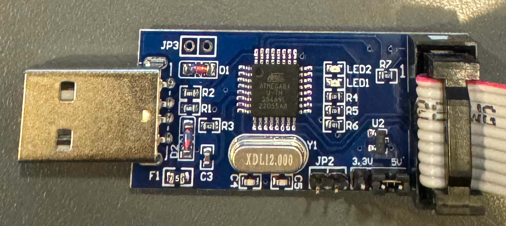

# 初期設定

## 前提

環境は、Ubuntu 22.04(実際はLubuntu)を使用。

## プログラマ

Amazonで売っていた[USBASP](https://www.amazon.co.jp/dp/B08687S7T1)を使用した。aitendoさんなら、[500円で売っている](https://www.aitendo.com/product-list?keyword=USBASP&Submit=%E6%A4%9C%E7%B4%A2)けど、Amazonのやつはケーブルが同梱なのと送料無料なのでそちらにした。後で解説するけど、USBASP内のFirmwareが古い場合が多いので、2つ入手した方が良い。

## 環境のインストール

Ubuntu(debian系)だと、aptで全部インストールできる。

```
sudo apt install gcc-avr avr-libc avrdude
```

USBAPを差してlsusbを実行してみる。上記のUSBASPは以下のように表示された。

```
Bus 001 Device 007: ID 16c0:05dc Van Ooijen Technische Informatica shared ID for use with libusb
```

## USBASPとの結線

[ここ](http://www.technoblogy.com/show?1YQY)に掲載されている。USBASPから電源が供給されるので、別途電源を用意する必要はない。

```
MOSI - 1
GND - 2
SCK - 3
VCC - 5
RST - 6
```

変換基板は秋月さんの[これ](https://akizukidenshi.com/catalog/g/g111966/)を使った。ルーペで見て、○が書かれているところが1番pinでそこから反時計回りに2-6pinになる。[仕様書](https://akizukidenshi.com/goodsaffix/attiny10-tshr.pdf)の1. Pin Configurationsを参照。

## 結線テスト

書き込みツールには```avrdude```を使用。-tを付けるとterminal modeに入るので、これを使ってテストする。

```
avrdude -c usbasp -p t10 -t
```
```
avrdude: warning: cannot set sck period. please check for usbasp firmware update.
avrdude: error: program enable: target doesn't answer. 1 
avrdude: initialization failed, rc=-1
         Double check connections and try again, or use -F to override
         this check.

avrdude done.  Thank you.
```

firmwareが古いかもよというエラーになったので、やはりfirmwareを更新しないといけないようだ。

!!! note

    私の環境では特にsudoを付けずにavrdudeを動かすことができた。もしもsudoを付けないとPermission Deniedになる場合は、[udevで設定できる](https://github.com/wbcr/attiny10-quickstart?tab=readme-ov-file)。

## firmwareの更新

USBASPに、JP2という場所があったのでピンヘッダを半田付け。


USBASP同士をつなぐ。コネクタに爪が付いているのに、差さる方向に差せば良い。写真で左側の方にショートピンが差してある。ショートピンが差してある側がFirmwareが書き込まれる側になる。


Firmwareを書く側(写真の右側。JP2にはショートピンを差さない)を、PCに接続する。
Firmwareを入手して展開。

```
wget https://www.fischl.de/usbasp/usbasp.2011-05-28.tar.gz
tar xf usbasp.2011-05-28.tar.gz
```

usbasp.2011-05-28/bin/firmwareの下に移動して、avrdudeで書き込む。

```
cd usbasp.2011-05-28/bin/firmware
avrdude -P usb -c usbasp -p m8 -U flash:w:usbasp.atmega8.2011-05-28.hex
```
```
avrdude: warning: cannot set sck period. please check for usbasp firmware update.
avrdude: AVR device initialized and ready to accept instructions

Reading | ################################################## | 100% 0.00s

avrdude: Device signature = 0x1e9307 (probably m8)
avrdude: NOTE: "flash" memory has been specified, an erase cycle will be performed
         To disable this feature, specify the -D option.
avrdude: erasing chip
avrdude: warning: cannot set sck period. please check for usbasp firmware update.
avrdude: reading input file "usbasp.atmega8.2011-05-28.hex"
avrdude: input file usbasp.atmega8.2011-05-28.hex auto detected as Intel Hex
avrdude: writing flash (4700 bytes):

Writing | ################################################## | 100% 3.01s

avrdude: 4700 bytes of flash written
avrdude: verifying flash memory against usbasp.atmega8.2011-05-28.hex:
avrdude: load data flash data from input file usbasp.atmega8.2011-05-28.hex:
avrdude: input file usbasp.atmega8.2011-05-28.hex auto detected as Intel Hex
avrdude: input file usbasp.atmega8.2011-05-28.hex contains 4700 bytes
avrdude: reading on-chip flash data:

Reading | ################################################## | 100% 2.44s

avrdude: verifying ...
avrdude: 4700 bytes of flash verified

avrdude: safemode: Fuses OK (E:FF, H:D9, L:9F)

avrdude done.  Thank you.
```

Firmwareを書き込んだ方から、JP2のショートピンを外してこれをPCとATtiny10をつないで再度テストに挑戦。

```
avrdude -c usbasp -p t10 -t
```
```
avrdude: AVR device initialized and ready to accept instructions

Reading | ################################################## | 100% 0.01s

avrdude: Device signature = 0x1e9003 (probably t10)
```

OKになった。

## Lチカで動作確認

IDEとか使わずにmakeだけでビルドできるのがあったので使ってみる。

```
git clone https://github.com/wbcr/attiny10-quickstart
cd attiny10-quickstart
make
```
```
avr-gcc -c -std=gnu99 -g -Os -Wall -DF_CPU=1000000 -mmcu=attiny10 -c src/main.c -o src/main.o
avr-gcc -mmcu=attiny10 -o demo.elf src/main.o
avr-size demo.elf
    text   data     bss     dec     hex filename
     70       0       0      70      46 demo.elf
avr-objcopy -O ihex demo.elf demo.hex
```

PIN4(PB2)にLEDをつなぐ。電流制限抵抗は330Ωにした。avrdudeで書き込む。

```
avrdude -c usbasp -p t10 -U flash:w:demo.hex
```
```
avrdude: AVR device initialized and ready to accept instructions

Reading | ################################################## | 100% 0.01s

avrdude: Device signature = 0x1e9003 (probably t10)
avrdude: NOTE: "flash" memory has been specified, an erase cycle will be performed
         To disable this feature, specify the -D option.
avrdude: erasing chip
avrdude: reading input file "demo.hex"
avrdude: input file demo.hex auto detected as Intel Hex
avrdude: writing flash (70 bytes):

Writing | ################################################## | 100% 0.29s

avrdude: 70 bytes of flash written
avrdude: verifying flash memory against demo.hex:
avrdude: load data flash data from input file demo.hex:
avrdude: input file demo.hex auto detected as Intel Hex
avrdude: input file demo.hex contains 70 bytes
avrdude: reading on-chip flash data:

Reading | ################################################## | 100% 0.03s

avrdude: verifying ...
avrdude: 70 bytes of flash verified

avrdude done.  Thank you.
```

LEDが0.5秒間隔で点滅する。

ATtiny10、書き込みも楽だしフルスペック(最適化on)のGCCが使えるし、良いね。

